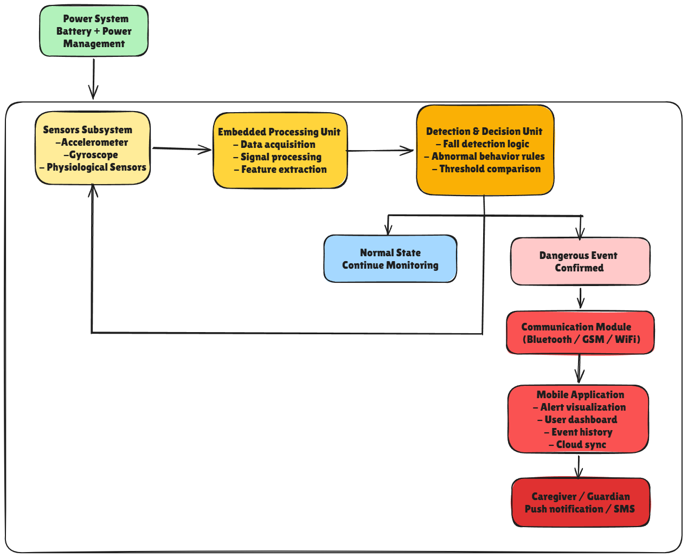
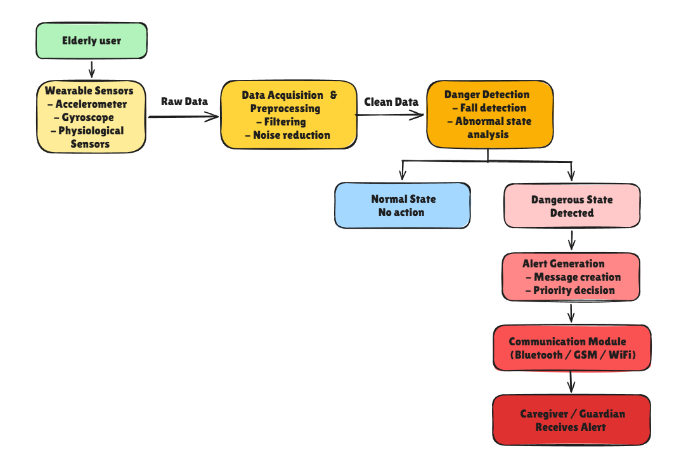

<h1 align="center">🧓 State Tracker</h1>

<p align="center">
Wearable monitoring system for elderly safety and health tracking
</p>

<p align="center">


</p>

---

# 📖 Definition

**State Tracker** is a wearable monitoring device designed to help elderly people who live alone.  
The system continuously monitors biometric and motion data to detect dangerous situations such as falls or abnormal physiological states.

If a risk is detected, the system automatically alerts caregivers or guardians through a communication system.

---

# 🎯 Project Objective

The goal of this project is to:

- Monitor elderly health conditions
- Detect dangerous situations such as falls
- Provide real-time alerts
- Allow caregivers to track the user's state remotely

This system aims to increase the safety and independence of elderly individuals living alone.

---

# ⚠️ Disclaimer

This device is designed for elderly people living alone.

It is **NOT intended for patients with**:

- Dementia
- Alzheimer’s disease
- Urinary disorders

These conditions require continuous medical supervision.

---

# 🧠 System Overview

The system collects **biometric and motion data** using sensors embedded in a wearable device.

The data is processed by a microcontroller and analyzed to detect abnormal situations.

If a dangerous state is detected, the system triggers an alert that is sent to caregivers via communication modules.

---

# 🏗 System Architecture

## Global System Architecture



### Explanation

1. **Power System**

The Power System provides the electrical energy required for the entire device.

It includes:

- Battery supply
- Power management circuitry

This subsystem ensures that all hardware components operate reliably and efficiently while maintaining low power consumption for wearable usage.

---

2. **Sensors Subsystem**

The Sensors Subsystem is responsible for collecting real-time physical and physiological data from the user.

The system integrates several sensors:

- Accelerometer → detects movement and sudden impacts
- Gyroscope → measures orientation and body rotation
- Physiological Sensors → monitor biometric signals such as heart rate and oxygen levels

These sensors provide the raw data required to monitor the user’s state.

---

3. **Embedded Processing Unit**

The Embedded Processing Unit acts as the core controller of the system.

Its main responsibilities include:

- Data acquisition from sensors
- Signal processing to interpret sensor data
- Feature extraction to identify relevant patterns

This processing stage prepares the data for the detection algorithms.

---

4. **Detection & Decision Unit**

This module analyzes the processed data to determine whether the user is in a safe or dangerous condition.

The system performs:

- Fall detection logic
- Abnormal behaviour analysis
- Threshold comparison

Based on these analyses, the system determines whether the user is in a normal state or a dangerous situation.

---

5. **Normal State Monitoring**

If the system detects normal activity, monitoring continues without any alert.

The sensors keep collecting data and the processing unit continues analyzing the user’s movements and physiological signals.

---

6. **Dangerous Event Detection**

When the system confirms a dangerous event such as:

-A fall
- Abnormal physiological values
- Unusual behaviour patterns

the alert mechanism is activated.

---

7. **Communication Module**

The Communication Module transmits alerts and data to external systems.

Supported communication technologies include:

- Bluetooth
- GSM
- WiFi

These technologies allow the system to send notifications even if the user is alone.  

---

8. **Mobile Application**

The Mobile Application serves as the user interface for caregivers.

It provides features such as:

- Alert visualization
- User monitoring dashboard
- Event history tracking
- Cloud synchronization

This application allows caregivers to monitor the elderly user remotely.

---

9. **Mobile Application**

When a dangerous event is detected, the system immediately sends a notification to caregivers.
Alerts may be delivered via:

- Push notifications
- SMS messages

This ensures a rapid response to emergencies and improves the safety of elderly individuals living alone.

---

# 🔄 Data Flow



### Explanation

1. The elderly user wears the monitoring device.

2. Sensors collect raw data including:

- Movement
- Acceleration
- Physiological signals

3. Data preprocessing removes noise and filters signals.

4. The danger detection algorithm analyzes the cleaned data.

5. If the system detects normal activity, monitoring continues.

6. If a dangerous state is detected:

- An alert is generated
- A message is sent to caregivers

---

# 🔧 Hardware Components

| Component | Purpose |
|---------|---------|
| **ESP32 S2** | Main microcontroller with wireless capabilities |
| **MAX30102** | Heart rate and blood oxygen monitoring |
| **MPU6050** | Motion tracking and fall detection |
| **GSM Module** | Sending emergency messages |
| **TVS Protection** | Static discharge protection |

---

# 💻 Technologies Used

- **JavaScript**
- Embedded systems
- IoT sensors
- Mobile communication
- Signal processing

---

Clone the repository:

```bash
git clone https://github.com/stiiven-dev/State-Tracker.git
cd State-Tracker
