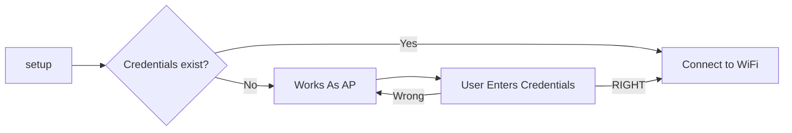

# How connectToMobile works

```mermaid
flowchart LR
    A[setup] --> B{Credentials exist?}
    B -->|Yes| C[Connect to WiFi]
    B -->|No| D[Works As AP]
    D --> G[User Enters Credentials]
    G --> |RIGHT| C
    G --> |Wrong| D
```
